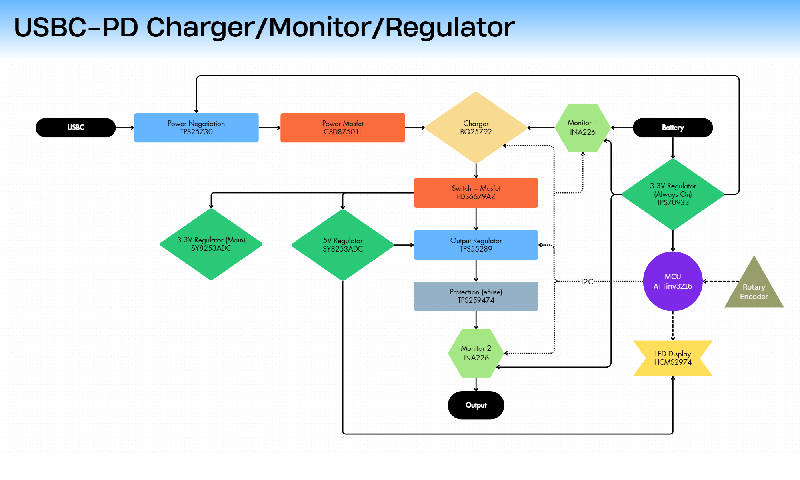

# Pocket Lab Power Supply

A lab bench power supply, but pocket-sized and battery powered. (This repo is currently WIP)

## What it is:

A 4S Lithium Ion-based Battery Bank which can act as a portable Lab-Bench Power Supply. Designed for use with 4S lithium-ion battery packs.

## Features:

- Adjustable output voltage and current limit
- Battery powered
- USB-C/PD charging
- 8-Character 5x7 LED Matrix Display 
- Open hardware and firmware

## Repository Structure:

- `/hardware` - PCB, schematic, BOM, Gerbers, CAD
- `/firmware` - MCU firmware and utilities
- `/docs` - build guide, diagrams, images, notes (WIP)

## Parts List

- Main PCB
- "Backpack" PCB for Display Module
- Display: HCMS-2971 or HCMS-2972 or HCMS-2973 or HCMS-2974 or HCMS-2975
- 4S 21700 Battery with integrated BMS (XH2.54mm connector) [LINK](https://www.foxbuying.com/21700-14-8v-4s1p-4500mah-rechargeable-power-lithium-battery-pack-with-customised-connetor.html)
- Faceplate
- 3D Printable Body
- 4x M3 Threaded Inserts
- 4x M3 Hex-head/socket bolts (16mm threaded portion)
- Plastic cap for button
- Encoder Knob [LINK](https://www.adafruit.com/product/5531)

## Documentation:

For common questions, see the [FAQ](docs/FAQ.md). This is a work in progress and I will add more.

The following flowchart gives an overview of the way the main components are connected.

## Safety Notice:

This project involves lithium-ion batteries and power electronics. Build and use at your own risk.

The PCB was designed for use with 4S battery packs. The BQ25792 will charge the pack up to 16.8V.

IF YOU WANT TO USE ANOTHER CELL CONFIGURATION YOU MUST CHANGE THIS! OTHERWISE THE CELLS WILL BE OVERCHARGED AND DAMAGED!

(Pin 20 "PROG" on the BQ25792 is the thing you need to adjust.)

YOU MUST USE A PACK THAT CONTAINS A BMS! THIS DESIGN DOES NOT INCLUDE ONE.

## License!

This project is licensed under the CERN Open Hardware Licence Version 2 - Strongly Reciprocal, CERN-OHL-S-2.0.

Unless otherwise stated, this applies to all hardware design files, firmware, software utilities, documentation, images, diagrams, CAD files, manufacturing files, and other project files in this repository.

Commercial use is allowed under the terms of the license. The project name, author name, logo, branding, and media identity are not licensed for use in marketing or endorsement without permission.

See `LICENSE.txt` for the full license text.
